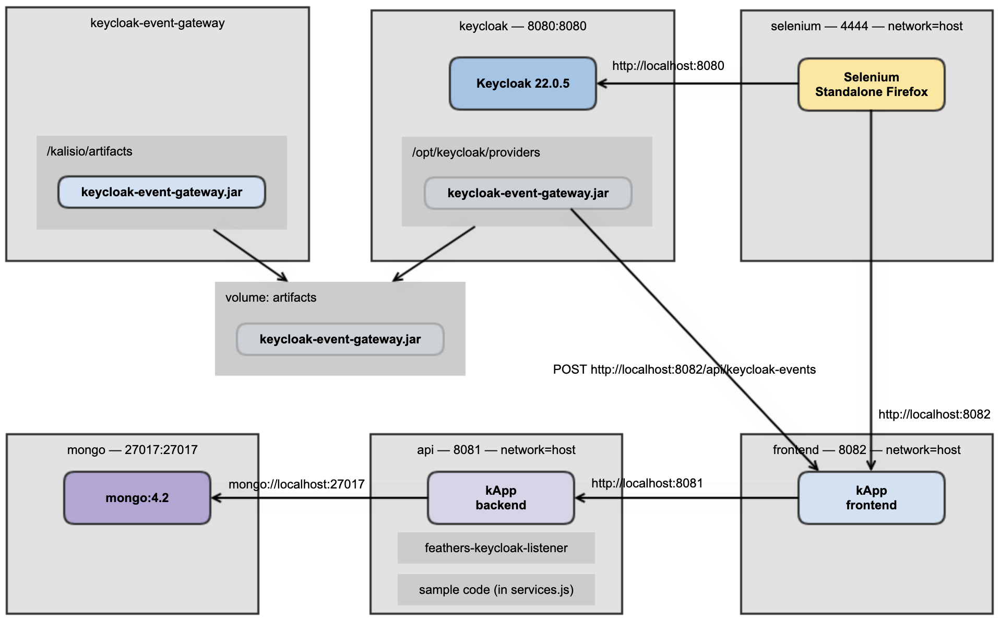

_[Back to the home page](../README.md)
— Previous page: [5. How to deploy locally](Deploy.md)
— Next page: [7. Troubleshooting](Troubleshooting.md)_


---

# 6. How to test


## Run the tests

Prerequisites: Node, Docker.

```shell
$ cd test
$ docker-compose up -d
```


It deploys the following stack:



The sample Feathers
application we use in this environment
is 
Kalisio’s [kApp](https://kalisio.github.io/kApp/).


Then run:

```shell
$ npm install
$ export SELENIUM_REMOTE_URL=http://localhost:4444/wd/hub
$ npx mocha kApp_login_as_kalisio.js
$ npx mocha keycloak_setUp.js
$ npx mocha kApp_login_as_kalisio_through_keycloak.js
$ npx mocha keycloak_create_new_user.js
$ npx mocha kApp_login_with_new_user_through_keycloak.js
$ npx mocha kApp_login_with_new_user.js
$ npx mocha keycloak_delete_user_previously_created.js
$ npx mocha keycloak_tearDown.js
```

The tests should be run in that order.

You can skip some tests, but then,
depending on the current step, you may have to
provide `KAPP_ACCESS_TOKEN`
and/or `KAPP_ACCESS_TOKEN2` in the environment.
See below.


## More details about the tests

We present each test suite.

First, run:

```shell
$ npm install
$ export SELENIUM_REMOTE_URL=http://localhost:4444/wd/hub
$ npx mocha kApp_login_as_kalisio.js
```

This first test, `kApp_login_as_kalisio.js`,
logs in the kApp GUI and
checks that your kApp deployment is functional.

It also stores a kApp access token
in a local `cache.json` file.


> For information, here is the way to get an access token for the kApp:
> 
> ````
> curl --location 'http://localhost:8082/api/authentication' \
>     --header 'Content-Type: application/json' \
>     --data-raw '{
>         "strategy": "local",
>         "email": "kalisio@kalisio.xyz",
>         "password": "Pass;word1"
>     }'
> ````

Now, run:

```shell
$ npx mocha keycloak_setUp.js
```

This second test
logs in the Keycloak GUI, and
configures
Keycloak so you will be able to
log in the kApp through Keycloak
in a “Kalisio” realm;
It also adds the
[keycloak-event-gateway](https://github.com/kalisio/keycloak-event-gateway) listener
and uses the access token found previously.

Troubleshooting: If the creation of the
“Kalisio” realm fails — generally because you ran
the test twice in a row —, delete it in Keycloak
and run `npx mocha keycloak_setUp.js` again.

During this test, 
a `KEYCLOAK_CLIENT_SECRET` environment
variable will
be logged in the console.

Add it to the runtime context of your kApp’s
API and
restart the API.

Now you can continue to run the tests:

````
$ npx mocha kApp_login_as_kalisio_through_keycloak.js
````

This third test checks that the 
back-and-forth redirect URLs between the kApp
and Keycloak are functional.

````
$ npx mocha keycloak_create_new_user.js
````

This fourth test creates a new user in Keycloak,
and checks, via the kApp‘s API, that the user count
has increased by 1. That means the communication
between the Keycloak listener and the Feathers
endpoint is functional.

> This test uses a kApp access token. If you
> did not run previous tests, you will have to
> provide the access token through the command line:
> 
> ```
> export KAPP_ACCESS_TOKEN=<your access token>
> ```


During the test,
the `cache.json` file is updated, to pass
information to the next test. It contains
the data randomly generated used during the tests.

Example of such a `cache.json` file:

````
{
    "newUsername":"petitponeyllhnu4lya8",
    "newEmail":"petitponeyllhnu4lya8@gmail.com",
    "newPasswordInKeycloak":"tutu",
    "newPasswordInKApp":"petitponeyllhnu4lya8-Pass;word1",
    "clientSecret":"dWyLFdRH06NqhVkoN8lNLU5fHw2rZ39l"
}
````

Continue to run the tests:

````
$ npx mocha kApp_login_with_new_user_through_keycloak.js
````

This fifth test logs in the kApp through Keycloak.
This is not a big deal, since the user was created
in Keycloak.


````
$ npx mocha kApp_login_with_new_user.js
````

This sixth test is more interesting: It logs
in the kApp directly with the new user (and a
password different than the one in Keycloak.)
This ensures that the user has been created in
the kApp’s database through the Feathers service.


For now a _second_ access token 
is emitted (corresponding to an authorization
for the second user), that
will be used to run the “delete user” test.

This access token is stored in `cache.json`
by the test.

> If you didn’t run that test, you must provide
> the access token through the command line:
> 
> ```
> $ export KAPP_ACCESS_TOKEN2=<your access token2>
> ```
>
> Here is a way to get this second access token for the kApp:
> 
> ````
> curl --location 'http://localhost:8082/api/authentication' \
     --header 'Content-Type: application/json' \
     --data-raw '{
         "strategy": "local",
         "email": "petitponeyllhnu4lya8@gmail.com",
         "password": "petitponeyllhnu4lya8-Pass;word1"
     }'
> ````
> 
> Those are the values from `cache.json`.

At this point, you can run:

````
$ npx mocha keycloak_delete_user_previously_created.js
````

This seventh test deletes in Keycloak
the user previously created, and checks via
the kApp’s API that the user count has been
decreased by 1.


At this point everything should be fine.

If you want to delete the “Kalisio” realm 
in Keycloak via the command line, run:

````
$ npx mocha keycloak_tearDown.js
````

This eighth test logs in the Keycloak GUI
and deletes the “Kalisio” realm.


## Troubleshooting

If you are making modifications to the code
and redeploy via `docker-compose`
and don’t see your modifications,
the temporary Docker image `tmp/kapp`
may have to be updated.

In that case, use:

````
$ docker-compose down
$ docker rmi -f tmp/kapp
$ docker-compose up -d
````

It can take some time.


## Test results: screenshots

Screenshots are taken during the tests
and saved in the `test/screenshots`
directory.

Examples can be seen here:
[feathers-keycloak-listener-screenshots](https://gitlab.com/avcompris/kalisio/feathers-keycloak-listener-screenshots/)


## Continuous Integration — CI

As for now, autonomous
tests are run in a GitLab CI
environment.

See the [`.gitlab-ci.yml`](../.gitlab-ci.yml) configuration.


---

_[Back to the home page](../README.md)
— Previous page: [5. How to deploy locally](Deploy.md)
— Next page: [7. Troubleshooting](Troubleshooting.md)_


